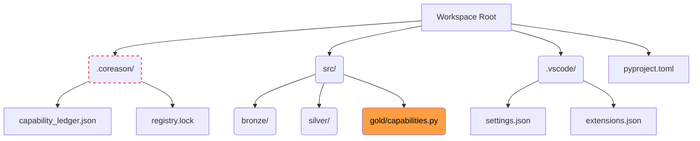

# Workspace Genesis & Ignition

An enterprise AI Swarm cannot be executed as a loose collection of ephemeral Python scripts. To mathematically guarantee deterministic execution and prevent state space collapse, the infrastructure must be provisioned as a tightly bounded **Thermodynamic Mesh**.

This guide serves as the definitive deployment blueprint for DevOps leads and Site Reliability Engineers (SREs). It covers how to scaffold a mathematically verified workspace from zero, ignite the physical infrastructure, and verify the zero-trust network boundaries.

## 0. Day Zero Prerequisites

Before initiating the genesis sequence, the host environment must meet strict physical and software boundaries. The `coreason-ecosystem` hypervisor will violently reject execution if these prerequisites are not met.

!!! info "The Required Toolchain"
    * **Package Manager:** `uv` (The Swarm strictly enforces `uv` for deterministic, mathematically locked dependency resolution).
    * **Python Engine:** `>= 3.12`
    * **Container Engine:** Docker Daemon (must be actively running and accessible to the user).
    * **Sensory Matrix:** Visual Studio Code (required to render the Generative UI for the Oracle Loop).

!!! warning "Physical Hardware Bounds"
    The hypervisor does not just run code; it provisions several heavy-duty state engines (the Temporal orchestrator, the PostgreSQL Epistemic Ledger, and the Extism WASM Daemon).

    The host machine or virtual node must possess a minimum allocation of:
    * **RAM:** 4.0 GB
    * **Compute:** 2 Dedicated CPU Cores

## 1. Autopoietic Scaffolding (`coreason init`)

In legacy software engineering, developers routinely initialize projects with a simple `mkdir` or `git init`. In Cognitive Systems Engineering, doing so is a catastrophic anti-pattern. An enterprise AI Swarm cannot operate within an unstructured directory; it requires a mathematically perfect, zero-trust environment to prevent ontological drift.

To achieve this, the workspace must be generated autopoietically (self-assembling) via the CLI.

!!! abstract "The Genesis Command"
    Execute the following command to provision a completely sealed, deployment-ready Swarm workspace.
    ```bash
    uv run coreason init <project_name> --topology medallion
    ```

When you execute this command, the hypervisor does not just create folders; it provisions four strict structural boundaries:

### 1.1 The Epistemic Root of Trust (`.coreason/`)
The hypervisor generates a hidden `.coreason/` directory. This is the cryptographic heart of the Swarm.
* **`capability_ledger.json`**: An immutable dictionary that will eventually house the SHA-256 hashes of every compiled WebAssembly tool.
* **`registry.lock`**: The master Merkle tree file. If a single byte of schema definition drifts from the compiled WASM binaries, this lock will violently fail the Swarm's network boot sequence, protecting your databases from corrupted AI payloads.

!!! warning "Strict Anti-Pattern"
    **Never manually edit files within the `.coreason/` directory.** This directory is exclusively managed by the `coreason` CLI. Manual mutations will shatter the Epistemic Seal.

### 1.2 The Medallion Topology (`src/`)
By appending `--topology medallion`, the CLI scaffolds a strict data-engineering directory structure designed to funnel high-entropy data into perfectly crystallized schemas.

* **`bronze/` (The Raw Layer):** Unstructured data ingestion (PDFs, raw JSON, unverified text).
* **`silver/` (The Ontological Layer):** Intermediate logic where data is cast through `coreason-manifest` Pydantic schemas.
* **`gold/` (The Crystallized Layer):** The final execution domain containing the pure Python capabilities that will be Ahead-of-Time (AOT) compiled into WASM.

### 1.3 Sensory Binding (`.vscode/`)
To execute the **Human Oracle Circuit** (where an operator corrects a hallucinating AI via localized UI forms), the operator's IDE must be physically bound to the runtime's telemetry mesh.
The `init` command generates a strict `.vscode/settings.json` and `extensions.json`. This configuration forces the editor to listen to the Redis Server-Sent Events (SSE) stream, enabling the execution engine to temporarily hijack the IDE UI when the Swarm's Epistemic Yield threshold is breached.

### 1.4 Supply-Chain Sealing (`pyproject.toml`)
Floating dependencies (e.g., `coreason-runtime >= 1.0`) are unacceptable in a deterministic system. The scaffolder dynamically queries the host environment for the exact version of the hypervisor currently running. It generates a `pyproject.toml` that perfectly pins the newly created workspace to that exact version—ensuring your Swarm cannot be silently broken by an unverified upstream update six months from now.

### The Structural Output
Your generated workspace will mathematically mirror this exact topology:


